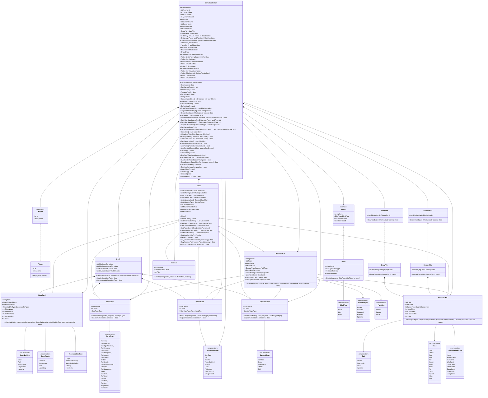

```mermaid

classDiagram

class GameController{
    +IPlayer Player

    +int MaxHand
    -int _currentHand
    +int MaxDiscard
    -int _currentDiscard

    +int Money

    +int CurrentRound
    +int CurrentAnte

    +int RoundScore
    +int CurrentScore

    -IDrawPile _drawPile
    -IDiscardPile _discardPile

    +Dictionary~int , List ~Blind~ ~ BlindEnemies

    %% POKER HAND
    +Dictionary~PokerHandType,int~ PokerHandLevel
    +Dictionary~PokerHandType,int~ PokerHandPlayed

    %% Tarot
    -TarotCard _lastTarotUsed

    %% Planet
    -PlanetCard _lastPlanetUsed

    +int CurrentChipToScore
    +float CurrentMultToScore

    +Shop Shop

    %% Action
    +Action~Blind~ OnBlindSelected
    +Action~List~PlayingCard~~ OnPlayHand
    +Action~int~ OnScore
    +Action~Blind~ OnBlindDefeated
    +Action OnGetCashout
    +Action OnShopOpen
    +Action~int~ OnNextRound
    +Action~int~ OnAnteAdvance

    +Action~PlayingCard~ OnAddPlayingCard

    +Action OnWinGame
    +Action OnGameOver

    %% METHOD
    +GameController(Player player)

    %% Game / Run
    +StartGame():bool
    %% +GetGameState()
    +GetCurrentRound():int
    +NextRound():bool
    +AdvanceAnte():bool
    +GameOver():bool
    +Win():bool

    %% Blind
    +GetAvailableBlinds(): Dictionary~int, List~Blind~~
    +SelectBlind(int blindId):bool
    +GetCurrentBlind():Blind
    +DefeatBlind():bool

    %% Draw/Hand
    +DrawCards(int count): List~PlayingCards~
    +PlayHand(List~PlayingCard~ cards):bool
    +DiscardCards(List~PlayingCard~ cards):bool
    +GetHand():List~PlayingCard~
    %% +GetDrawPileState()??
    -ReycleDrawPile(DrawPile drawPile, DiscardPile discardPile):bool

    %% Poker Hand
    +GetPokerHandLevels(): Dictionary~PokerHandType, int~
    +GetPokerHandPlayed():Dictionary~PokerHandType, int~
    -UpgradePokerHand(PokerHandType pokerHand):bool

    %% Scoring
    +GetCurrentScore():int
    +GetScorePreview(List~PlayingCard~ cards):Dictionary~PokerHandType, int~

    %% Joker
    +GetJokers():List~JokerCard~
    -AddJokers(List~JokerCard~ cards):bool
    +ArrangeJokers(List~JokerCard~ cards):bool
    +RemoveJokers(List~JokerCard~ cards):bool

    %% Consumable Card
    +GetConsumables():List~IUsable~
    +UseTarot(TarotCard tarotCard):bool
    +UsePlanet(PlanetCard planetCard):bool
    +UseSpectral(SpectralCard spectralCard):bool

    %% Shop
    +GetShop():Shop
    +RerollShop():bool
    +BuyCard(IPurchasable card):bool
    +GetBoosterPacks():List~BoosterPack~
    +BuyBoosterPack(BoosterPack pack):bool
    +SelectBoosterCards(List~IPurchasable~ cards):bool
    +GetVoucherOffer():Voucher
    +BuyVoucher(Voucher voucher):bool
    +LeaveShop():bool

    %% Money
    +GetMoney():int
    +Cashout():int
    -AddMoney(int money):bool
}

class Player{
    +int id
    +string Name
    %% Method
    +Player(string Name)
}

class Deck {
    +int MaxJokerContainer
    +int MaxConsumableContainer
    +List~JokerCard~ JokerCards
    +List~IUsableCard~ UsableCards
    %% Method
    +Deck(int sizeJokerContainer, int sizeConsumableContainer)
    +IsJokerContainerFull():bool
    +IsConsumableContainerFull():bool
}

class Blind{
    +string Name
    +BlindType BlindType
    +int ScoreToDefeat
    +bool IsDefeated
    %% Method
    +Blind(string name, BlindType blindType, int score)
}

class Shop{
    +List~JokerCard~ JokerCardOffers
    +List~PlayingCard~ PlayingCardOffers
    +List~TarotCard~ TarotCardOffers
    +List~PlanetCard~ PlanetCardOffers
    +List~SpectralCard~ SpectralCardOffers
    +List~BoosterPack~ BoosterPacks
    +Voucher? Voucher
    +int MaxItemCardOffers
    +int MaxItemBoosterPacks
    +int RerollCost

    %% Method
    +Shop()
    +CreateOffers():bool
    +GetJokerCardOffers():List~JokerCard~
    +GetPlayingCardOffers():List~PlayingCard~
    +GetTarotCardOffers():List~TarotCard~
    +GetPlanetCardOffers():List~PlanetCard~
    +GetSpectralCardOffers():List~SpectralCard~
    +GetBoosterOffers():List~BoosterPack~
    +GetVoucherOffer():Voucher
    +Reroll(int money):bool
    +Buy(IPurchasableCard card, int money):bool
    +Buy(BoosterPack boosterPack, int money):bool
    +Buy(Voucher voucher, int money):bool
}

class DrawPile{
    +List~PlayingCard~ playingCards
    %% METHOD
    +DrawCards(List~PlayingCard~ cards)
}

class DiscardPile{
    +List~PlayingCard~ playingCards
    %% METHOD
    +DiscardCards(List~PlayingCard~ cards)
}

class BoosterPack{
    +string Name
    +int Price
    +int MaxPick
    +int TotalCard
    +BoosterType BoosterPackType
    +PackSize PackSize
    +List~PlayingCard~ PlayingCards
    +List~TarotCard~ TarotCards
    +List~PlanetCard~ PlanetCards
    +List~SpectralCard~ SpectralCards

    %% Method
    +BoosterPack(strin name, int price, int maxPick, int totalCard, BoosterType type, PackSize size)
}

class Voucher{
    +string Name
    +VoucherEffect Effect
    +int Price
    %% Method
    +Voucher(string name, VoucherEffect effect, int price)
}

class PlayingCard {
    +Suit Suit
    +Rank Rank
    +EnhancePokerCard Enhancement
    +int BaseChips
    +float BaseMult
    +float BaseXMult
    +int Price

    %% METHOD
    +PlayingCard(Suit suit,Rank rank, EnhancePokerCard enhancement = EnhancePokerCard.None, int price)
}

class JokerCard{
    +string Name
    +JokerEdition Edition
    +JokerRarity Rarity
    +JokerModifierType JokerModifierType
    +int ChipsValue
    +float MultValue
    +float XMultValue
    +int MoneyValue
    +int Price

    %% METHOD
    +JokerCard(string name, JokerEdition edition, JokerRarity rarity, JokerModifierType type, float value, int price)
}

class TarotCard{
    +string Name
    +int Price
    +TarotType Type
    %% METHOD
    +TarotCard(string name, int price, TarotType type)
    +Use(GameController controller):bool
}

class PlanetCard{
    +string Name
    +int Price
    +PokerHandType PokerHandType
    %% METHOD
    +PlanetCard(string name, PokerHandType pokerHand)
    +Use(GameController controller):bool
}

class SpectralCard{
    +string Name
    +int Price
    +SpectralType Type
    %% METHOD
    +SpectralCard(string name, int price, SpectralType type)
    +Use(GameController controller):bool
}

%% =====
%% INTERFACES
%% =====

class IPlayer{
    <<interface>>
    +int id
    +string Name
}

class IDrawPile{
    +List~PlayingCard~ PlayingCards
    +DrawCards(List~PlayingCard~ cards):bool
}

class IDiscardPile{
    +List~PlayingCard~ PlayingCards
    +DiscardCards(List~PlayingCard~ cards):bool
}

class IBlind {
    <<interface>>
    +string Name
    +BlindType BlindType
    +int ScoreToDefeat
    +bool IsDefeated
}

%% =====
%% Relationship
%% =====

%% =========================
%% Interface Implementation
%% =========================

IPlayer <|.. Player
IDrawPile <|.. DrawPile
IDiscardPile <|.. DiscardPile

%% =========================
%% GameController
%% =========================

GameController *-- IPlayer
GameController *-- Deck
GameController *-- Shop
GameController *-- IDrawPile
GameController *-- IDiscardPile
GameController --> IBlind

%% =========================
%% Draw / Discard Pile
%% =========================

DrawPile *-- PlayingCard
DiscardPile *-- PlayingCard

%% =========================
%% Player / Deck
%% =========================

Deck *-- JokerCard
Deck *-- TarotCard
Deck *-- PlanetCard
Deck *-- SpectralCard

%% =========================
%% Shop
%% =========================

Shop o-- JokerCard
Shop o-- PlayingCard
Shop o-- TarotCard
Shop o-- PlanetCard
Shop o-- SpectralCard
Shop o-- BoosterPack
Shop o-- Voucher

%% =========================
%% Booster Pack
%% =========================

BoosterPack o-- PlayingCard
BoosterPack o-- TarotCard
BoosterPack o-- PlanetCard
BoosterPack o-- SpectralCard

%% =========================
%% GameController -> Cards
%% =========================

GameController --> PlayingCard
GameController --> JokerCard
GameController --> TarotCard
GameController --> PlanetCard
GameController --> SpectralCard
GameController --> BoosterPack
GameController --> Voucher

%% =========================
%% Card -> Enum
%% =========================

PlayingCard --> Suit
PlayingCard --> Rank
PlayingCard --> EnhancePokerCard

JokerCard --> JokerEdition
JokerCard --> JokerRarity
JokerCard --> JokerModifierType

Blind --> BlindType

BoosterPack --> BoosterType
BoosterPack --> PackSize

TarotCard --> TarotType
PlanetCard --> PokerHandType
SpectralCard --> SpectralType

%% =========================
%% GameController -> Enum
%% =========================

GameController --> PokerHandType

%% =========================
%% Blind
%% =========================
IBlind <|.. Blind


%% =====
%% ENUMS
%% =====

class Suit {
    <<enumeration>>
    Hearts
    Diamonds
    Clubs
    Spades
}

class Rank {
    <<enumeration>>
    Two
    Three
    Four
    Five
    Six
    Seven
    Eight
    Nine
    Ten
    Jack
    Queen
    King
    Ace
}

class EnhancePokerCard {
    <<enumeration>>
    None
    BonusCards
    MultCards
    WildCards
    GlassCards
    SteelCards
    StoneCards
    GoldCards
    LuckyCards
}

class PokerHandType {
    <<enumeration>>
    HighCard
    Pair
    TwoPair
    ThreeOfAKind
    Straight
    Flush
    FullHouse
    FourOfAKind
    StraightFlush
}

class JokerEdition {
    <<enumeration>>
    Base
    Foil
    Holographic
    Polychrome
    Negative
}

class JokerRarity {
    <<enumeration>>
    Common
    Uncommon
    Rare
    Legendary
}

class JokerModifierType {
    Chips,
    AdditionMultiplier,
    MultiplierMultiplier,
    Money,
    HandSize,
}

class BoosterType {
    <<enumeration>>
    Arcana
    Celestial
    Standard
    Buffoon
    Spectral
}

class PackSize {
    <<enumeration>>
    Normal
    Jumbo
    Mega
}

class BlindType {
    <<enumeration>>
    Small
    Big
    Boss
}

class TarotType{
    <<enumeration>>
    TheFool,
    TheMagician,
    TheHighPriestess,
    TheEmpress,
    TheEmperor,
    TheHierophant,
    TheLovers,
    TheChariot,
    Justice,
    TheHermit,
    TheWheelFortune,
    Strength,
    TheHangedMan,
    Death,
    TheDevil,
    TheTower,
    TheStar,
    TheMoon,
    TheSun,
    Judgement,
    TheWorld
}

class SpectralType{
    <<enumeration>>
    Familiar,
    Grim,
    Incantation,
    Wraith,
    Sigil
}

```